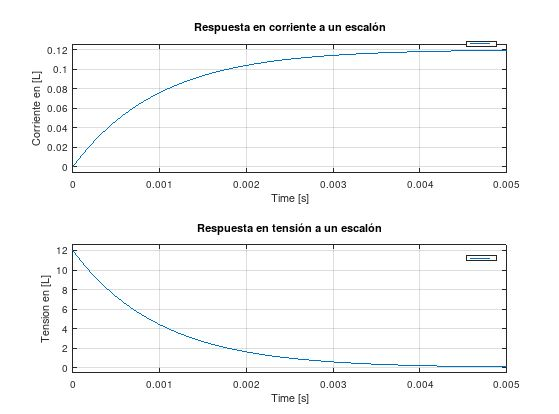

# TP

## Formulas

## Resolucion
La impedancia equivalente del circuito es:

Por estar en serie, la corriente de todos los elementos es la misma 

Entonces se puede obtener la funcion de transferencia con la corriente del inductor como salida de la siguiente manera:

De la misma forma, siendo que la corriente es la misma para todo el circuito, se puede obtener la funcion de transferencia con la tension del inductor como salida:

## Resultados

* Cuando t = 0

* Cuando t = inf

## Conclusion
Se podria decir que el inductor actua al reves que un capacitor.
Cuando llega a estado estacionario la tension se anula y la corriente a traves de el es maxima
